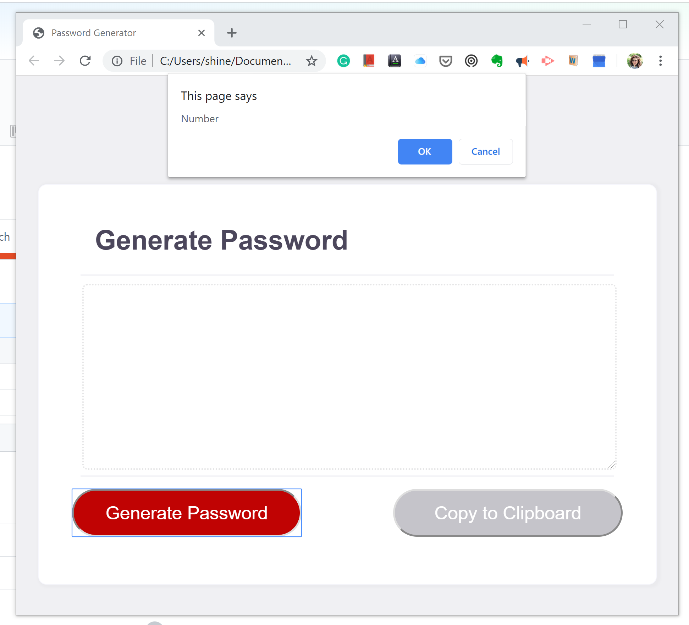
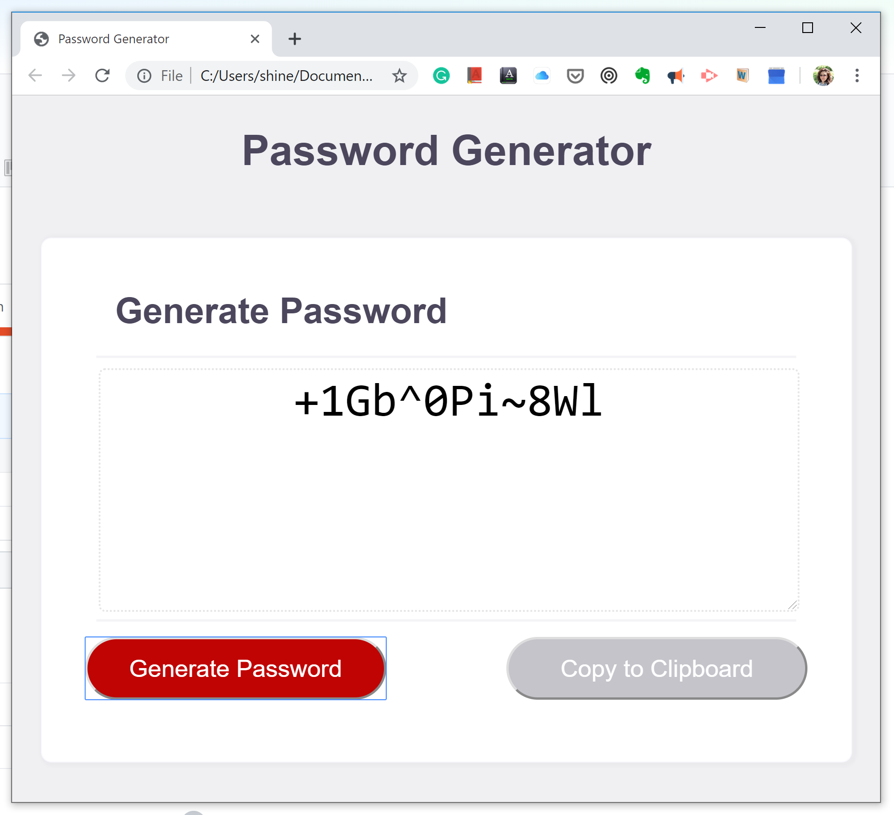

# Homework3

<Javascript Part>

1. Genrate button triggers the prompt asking the length of password to user

2. Folliwing the questions of what type of characters user is going to use.

3. Using while loop, among the character types user chose, 
   computer chose each character until it add up to the length the user chose.

   
   
   
<CSS Part>
  
1. Screen responsive over 980px 

2. Screen responsive between 980px and 500px

